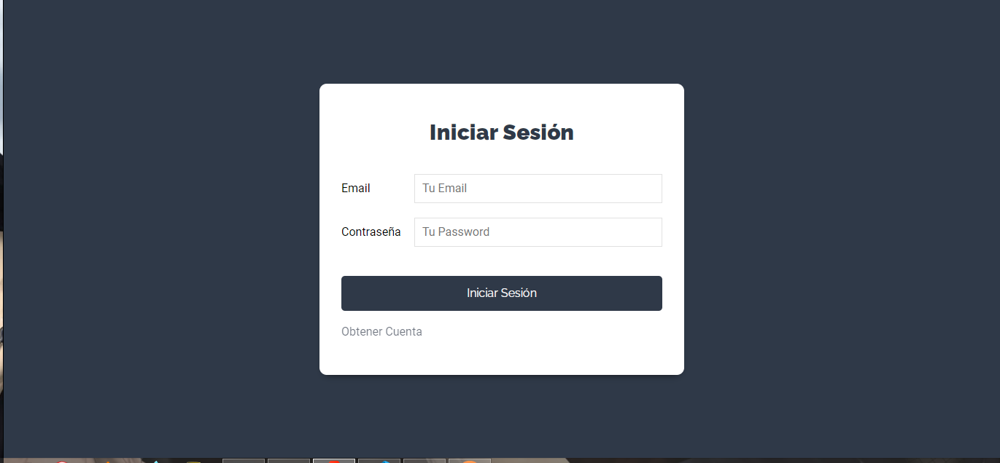
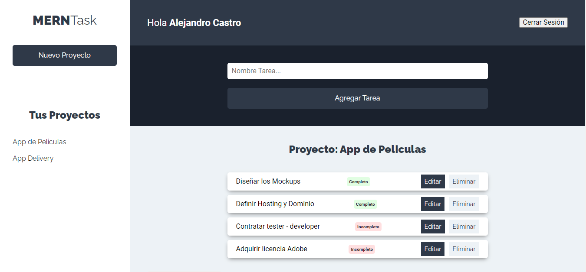

# Frontend APP MANAGER PROJECTS - REACT JS 

Este proyecto está creado utilizando el framework REACTJS, que se conecta a una REST API con autentitación a traves de Json Web Tokens.

 `Pantalla de login`

 `Panel de administración`

## Demo
Puedes ver el resultado en la [Demo](https://projects-app.netlify.app/).

## Instalación 
### `Descargar el repositorio`
### `Ir a la carpeta del proyecto`
### `npm install`
### `npm start`

